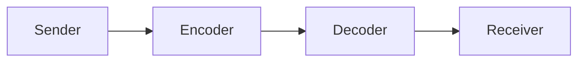
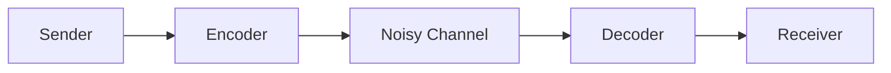

> The reader may refer to the [Chinese version](/blog/posts/decoding-in-QEC-cn). 
{: .prompt-tip }

In the field of quantum error correction, the term “decoding” carries two distinct but equally relevant meanings. The first refers to the quantum circuit that maps logical qubits back to physical qubits (the inverse of encoding), while the second refers to the classical procedure of inferring errors from a measured syndrome. 

For example, one should constantly run a decoder, in the second sense, for a quantum memory, but a decoding circuit in the first sense is in general not fault-tolerant, and hence never used. However, canonical procedure for magic state distillation involves a decoding circuit in the first sense, but does not require classical decoding in the second sense--its error suppression of magic states originates from post-selection.

In this blog post, we shall not discuss any technical detail on any kind of decoding. We shall instead discuss why these two meanings make sense.

## Heredity from classical

Etymologically, decoding is the inverse of encoding. Telegraphers decode Morse codes to messages; Phones decode electromagnetic waves to sounds; LLMs decode internal vectors to words in natural languages... A general simplest model is a noiseless channel.

The encoder may have different purposes. It may want to transfer the information over the air, so it encodes the information into Morse code and further into electromagnetic waves. It may want to store a figure in a computer, so it encodes pictorial data into bit strings. In such cases, the encoder encodes some human-interpretable data into other forms. 

However, we would like to discuss on a more abstract level of encoding abstract bit strings into other bit strings. Nevertheless, there can be many different purposes to do so. One may want to store the information efficiently, and thus encodes it by some compression algorithm. This is the topic of Shannon's source coding theorem. One may want to keep the information safe from unwanted observers, and thus encodes it by some encryption algorithm. In this case the decoding process is usually called decryption. This is the topic of cryptography. In all these cases, both encoding and decoding is non-trivial.

The most relevant encoding and decoding procedure for us is under the purpose of protecting information from the noise, with the help of error-correcting codes. For example, with linear codes, one encodes the information by multiplying it by a matrix. Without noise, the decoder just works as multiplying by another pre-determined matrix. This is trivial. However, it becomes non-trivial under a noisy channel.

Now the decoder is no longer merely the inverse of the encoder. It contains two stages now: first to remove the noise with the help of the structure of the error-correcting code, and then to map the noise-removed information back by multiplying the same pre-determined matrix as in the noiseless case. The second stage is the same as the decoder in the noiseless case. But it is now the noise removal stage that is non-trivial, and the central interest in this situation. So in classical coding theory, the term "decoding" is narrowed to refer exclusively to this noise removal stage. 

Quantum error correction community inherits the narrowed usage of "decoding" from classical coding theory, which is the second meaning mentioned in the beginning. However, in the quantum world, to undo the encoding of a quantum code, one must implement a quantum circuit, rather than compute a matrix multiplication in a classical computer. Therefore, unlike classical linear codes, the inverse of the encoding procedure can still be non-trivial and useful in the quantum world. So the first meaning mentioned in the beginning emerges as another way to use this term.

## Variation from classical

Variation is always as important and interesting as heredity.

In the diagrams above discussing the notion of decoding for classical information, I plotted a Sender and a Receiver, which can be safely viewed as being *homo sapiens* or any other classical extraterrestrial intelligence. However, we should not expect a parallel structure in quantum error correction. Actually, we do not adopt the classical channel picture in quantum error correction, at least for the purpose of fault-tolerant quantum computation (FTQC). In FTQC, we generally consider initial states in computational basis, and the final step is usually measuring qubits in computational basis. To do this, we do not need to start from a general quantum state in a physical qubit and run an encoding circuit (which is in general non-fault-tolerant), and neither do we need to run a decoding circuit (also non-fault-tolerant) or extract full knowledge from the encoded final state (which is the problem of tomography). Most of the time we do everything inside quantum codes. For special gadgets such as magic state distillation and teleportation[^1], encoding and decoding circuits are needed on top of another base code. However, "decoding" a quantum code to an expression on a blackboard to be read by *homo sapiens* has never been a task of quantum error correction.

Another common misunderstanding is that, the property that a classical decoder of a quantum code cannot obtain any knowledge of the encoded state is inherently quantum due to the non-cloning theorem of quantum states. Actually, you can also make the decoder of a classical linear code ignorant of the encoded information by only giving it access to the parity check data. It is the linear structure that makes it possible to remove the noise without knowing anything about the encoded information. Quantum non-cloning theorem forces one to use this structure, rather than implies this property.

## Coding theory in language

In short, the term "decoding" underwent a narrowing in classical coding theory, which is inherited by quantum error correction. With the variation between quantum and classical codes, the heredity may seem confusing. Interestingly, this evolution of terminology can also be viewed as an application of the source coding theory since it is driven by such a tendency that people prefer a concise term for a non-trivial and frequently discussed notion.

[^1]: I refuse to use the term "injection" since it is also abused by the community to have two meanings: encoding and gate teleportation, which makes less sense as the case for "decoding"